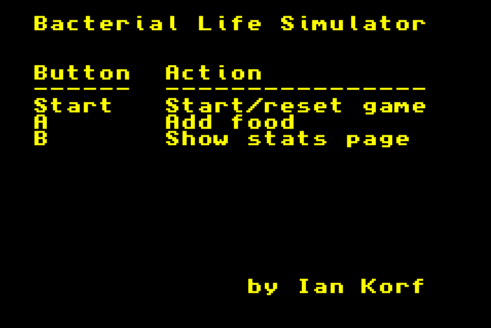
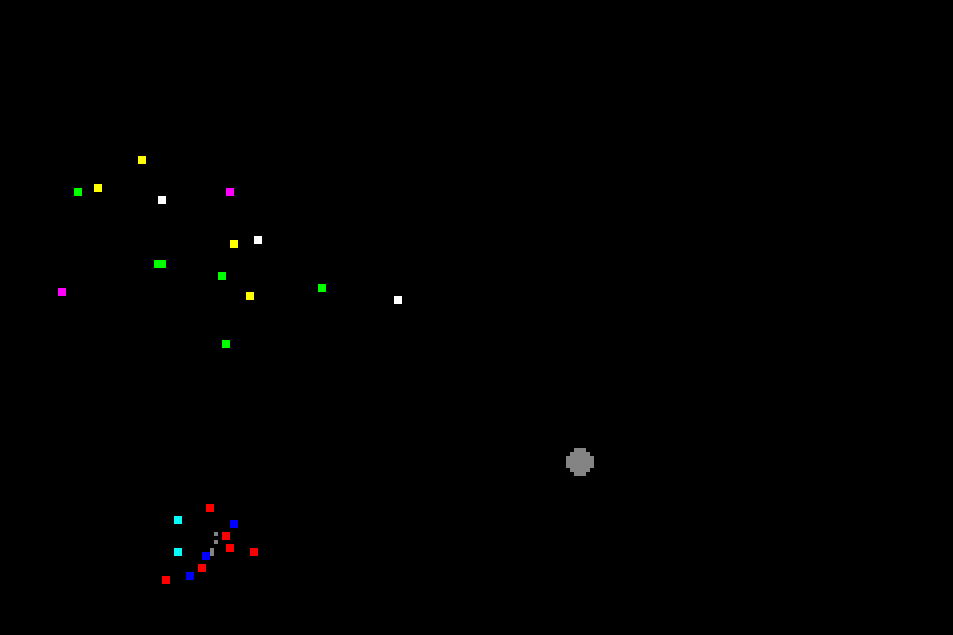
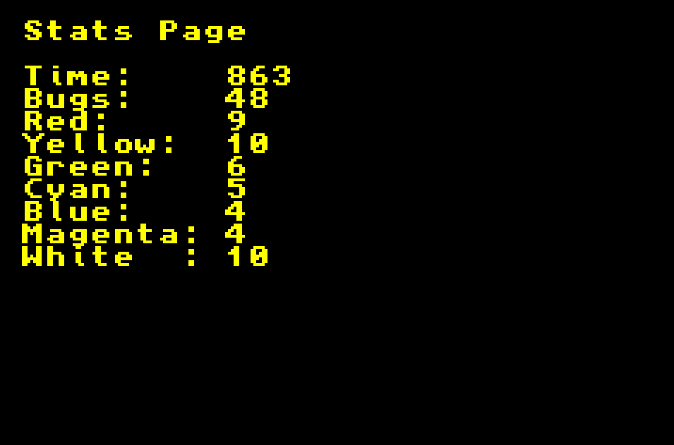
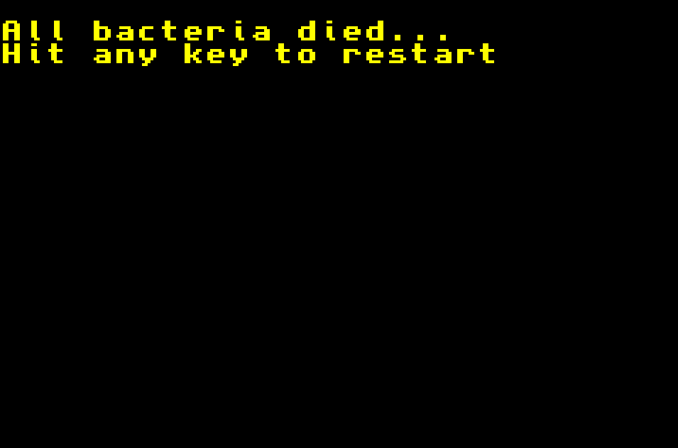

GBA Chemotaxis
==============

This is a game that simulates bacterial chemotaxis and population dynamics.



The simulation starts with 7 colored bacteria and one piece of food. The
bacteria will move toward the food. If they consume enough food, they will
divide to produce another bacterium of the same color.



Hitting the `A` button drops more food into the simulation. There is a maximum
number of food (5) and bacteria (100). If all the food is consumed, the
bacteria will vibrate with Brownian motion.

Hitting the `B` button reveals the stats page, where you can see how much time
has passed and the current number of each bacterial species.



Life takes energy, and if you don't keep adding food, the bacteria will
eventually starve to death.



## Science ##

Bacteria have flagella, which are whip-like appendages that act like
propellers. When spun in one direction, the bacteria swim in a straight line.
When spun in the other direction, they tumble randomly, which sends them in a
new direction. Chemicals at the microscopic level don't really have direction.
Bugs can't use noses to figure out where food is. Instead, they poll the
environment and ask if the concentration of food is greater now than when they
last checked. The algorithm for bacterial chemotaxis (finding food) is very
simple and effective.

```
if food is closer than before: swim_straight
else: find a new direction
```

In the simulation, bacteria "intend" to travel in 8 possible directions.
However, they get bounced around a lot by Brownian motion, so they don't appear
to travel in straight lines.

## Social Commentary ##

After running the simulation for a while, you will see the populations change
and eventually some will go extinct. The bacterial species that start out
nearest food have an advantage over those that are far away. This advantage
tends to stay over time. The end result is those bacteria that start behind
tend to go extinct first. Initial conditions really matter.

In this simulation, all of the bacteria are on equal footing. The end result of
a "level playing field" isn't diversity, it's uniformity through extinction. If
your goal is to nuture diversity in society, you will not get there by making
the rules equal for everyone.

## Development ##

This was developed using devkitPro and mGBA with Lubutu on VirtualBox.

+ devkitPro https://devkitpro.org/wiki/devkitPro_pacman
+ mGBA https://mgba.io/downloads.html

```
wget https://apt.devkitpro.org/install-devkitpro-pacman
chmod +x ./install-devkitpro-pacman
sudo ./install-devkitpro-pacman
```

Also this

```
sudo dkp-pacman -S gba-dev
```

And this

```
export DEVKITPRO=/opt/devkitpro
export DEVKITARM=/opt/devkitpro/devkitARM
export DEVKITPPC=/opt/devkitpro/devkitPPC
PATH=$PATH:$DEVKITARM/bin:$DEVKITPRO/tools/bin
```
